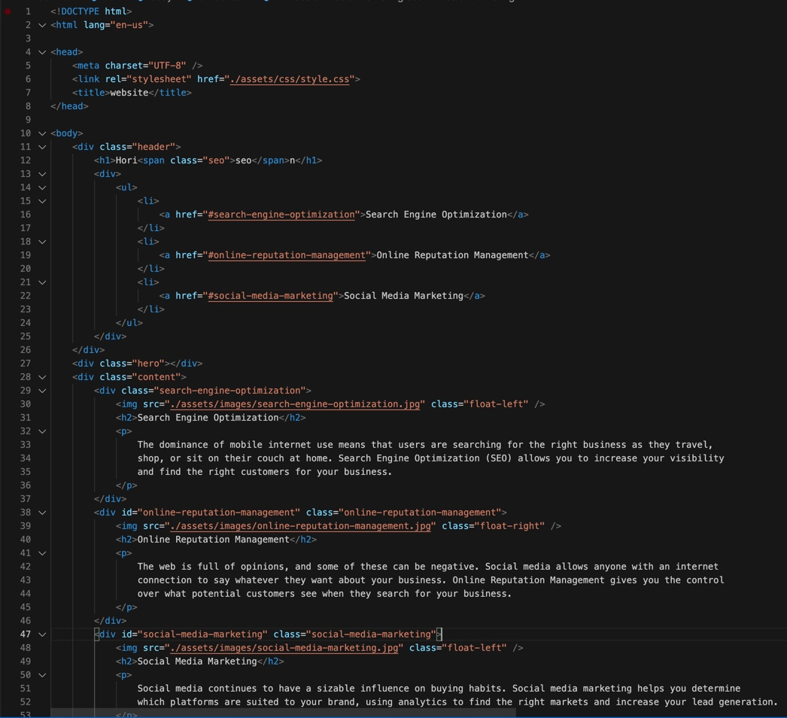
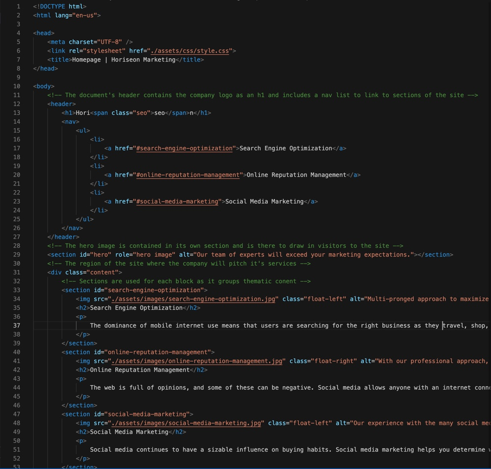

<<<<<<< HEAD
# site-refactor
Site-refactor assignment for css and html class
=======
# Site Refactor to Enhance Accessibility

## Description
For this project, I was starting with a simple document that was built to imitate a
landing page for a marketing service. My goal was to improve some accessibility aspects
without changing the original appearance on the user side. 

## The Process
The starting code had a few bugs, had poor structuring of heading tags, and did not
include any semantic tags or alt attritubtes to images. 

My approach was to approach the improvements in sections, starting with fixing any bugs
apparent in the GUI. Everything worked well, except a singular link in the main `<nav>`
that was not directing the user to intended portion of the page. From there i went to
laying out the site with semantic tags, adding comments throughout to identify the 
purpose of each portion of code. From there, I provided better structure for the heading
tags, added `alt` attributes to all `` tags, and gave an appropriate `<title>`.

## Usage
Come check out the new and improved site!

https://jkwalsh127.github.io/site-refactor/

## Credits
Staff at UC Berkeley Extension full-stack coding bootcamp
>>>>>>> 0d1f2e2 (Added conent to README and included associated images in assests file.)
